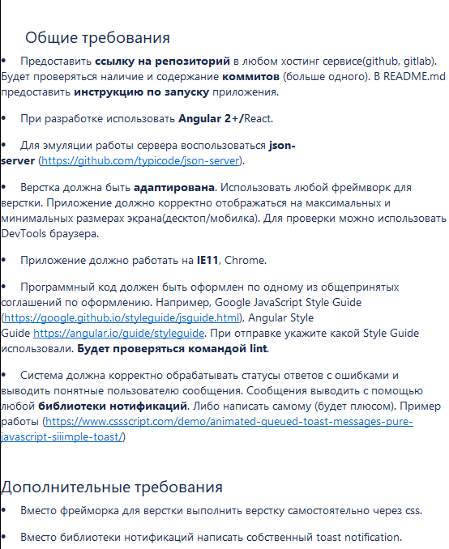

# NST-Test

Реализовать компонент,который возможно будет внедритьв сиситему. Компонент оперирует сущностью Сотрудник.

# Команды

* ```npm run start``` - запуск режима develop
* ```npm run build``` - запуск продуктовой версии
* ```npm run fake-json``` - запуск json-server

# Описание

Реализовать компонент,который возможно будет внедритьв сиситему. Компонент оперирует сущностью Сотрудник.

Приложение должно состоять:
1. Из одной страницы
2. Список сотрудников
3. Модально окно создания сотрудника
4. Модальное окно редактирования сотрудника
5. Модальное окно/tooltip даления сотрудника



